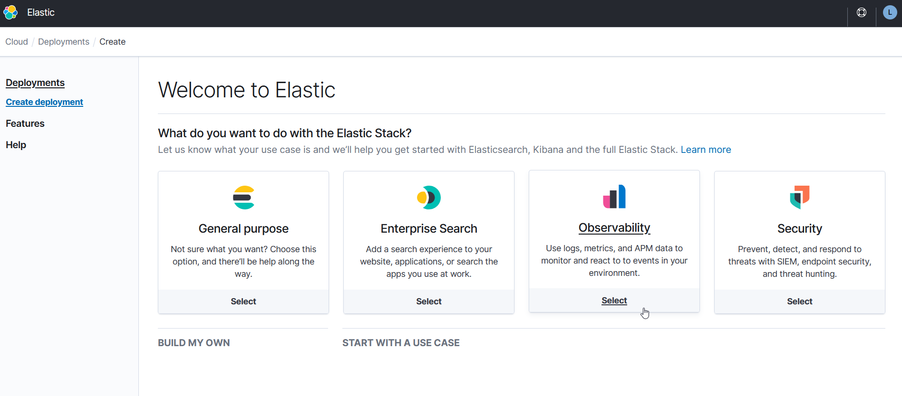

# Lab 0: Elastic Observability trial instance

Goal of Lab 0 is to acquire an Elastic Observability trail instance. It takes only a couple of steps.

Along the way, there is some information that has to be collected for the later labs.

## Create an account

Go to https://www.elastic.co/ :

click on the *Login* button in the right upperhand corner to go to Login:

Click *Sign up*: 

Enter your email and password and click *Start free trial*. That will bring you to this screen: 

Now, verify your account from the e-mail that you received: click Verify and Accept.

Now, on the already opened window go to the Cloud root:

Click *Start your free trial* 

And select Observability:

Look at the 'Deployment settings', the 'deployment name' and then click 'Create deployment' and wait for your `elastic`  credentials:

Save the credentials, you will need them later on ...

| item       | value |
|------------|-------|
|user        | elastic |
|password    | ...|

Wait until your trial instance has been created. This looks like:

Now, scroll down the page:

... and collect the following information:

| item       | value |
|------------|-------|
|Cloud ID    | elastic-observability-deployment:ZWFz ... |

Finally, go to the APM section:

... and collect the following information

| item       | value |
|------------|-------|
| endpoint | https://a341003.....29db18565a.apm.eastus2.azure.elastic-cloud.com | 
| APM Server secret token | 2X..............F5 | 

Now, your Elastic Observability set-up is ready for the remaining labs.
