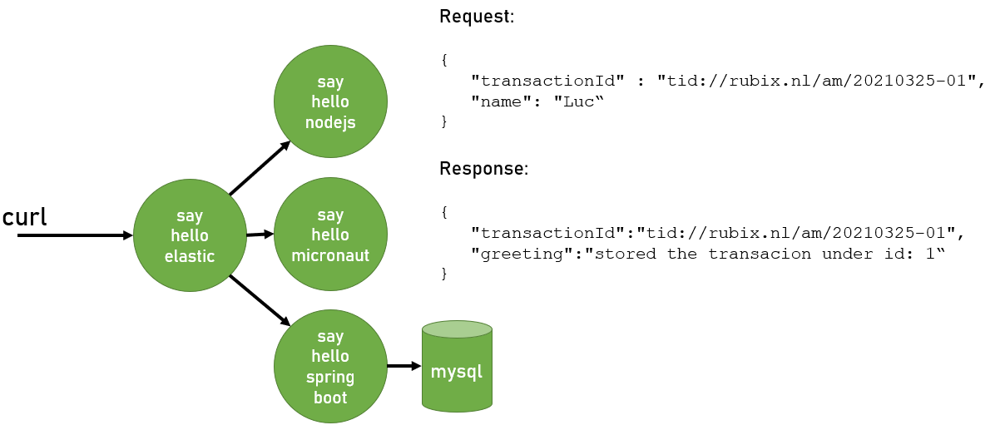

# Lab 1: Installation sample application

In this lab, we will install the sample application on our Kubernetes cluster.


## Pre-requisites

For running the sample application, you need:
- a Kubernetes cluster 
- the Kubernetes cluster can access images on Docker Hub
- Helm access to the cluster
 

The labs have been tested on a Minikube cluster, running on Ubuntu.

Intallation instructions for Minikube can be found [here](https://minikube.sigs.k8s.io/docs/start/).

For Helm installation instructions look [here](https://helm.sh/docs/intro/install/) (note: version V3 is used!)

It is assumed now that your k8s cluster is up and accessible...

## Sample application

The sample application consists of a number of microservices with different technologies:




## Installation of the sample application

The application will be deployed to the k8s cluster into the namespace `rubix-am-application`. First, create the namespace:
```bash
kubectl create ns rubix-am-application
```

Next, the application's microservices will be deployed using the provided Helm charts. For each microservice, the Helm chart's value file has to be updated with information on your Elastic Cloud instance.

### say-hello-springboot

Start by going to the directory where the helm chart is:

```bash
cd  lab-1_installation-sample-application/k8s/charts/say-hello-springboot
cp values-cloud-org.yml values-cloud.yml
```
Now edit the file `values-cloud.yml` and make 2 replacements:

| string | replace with |
|--------|--------------|
| [todo: set APM endpoint] | The APM endpoint from lab 0 |
| [todo: set APM Server secret token] | The APM Server secret token from lab 0 |

Next, the Helm chart can be deployed:
```bash
helm install say-hi-springboot --values values-cloud.yml -n rubix-am-application .
```

Verify that the Pods are started with `kubectl get pod -n rubix-am-application`. The output should look like:

```bash
NAME                                    READY   STATUS    RESTARTS   AGE
mysql-7894b776b9-hgbgn                  1/1     Running   0          63s
say-hello-springboot-74696cc4df-jxbts   1/1     Running   1          63s
```

### say-hello-micronaut

Start by going to the directory where the helm chart is:

```bash
cd  lab-1_installation-sample-application/k8s/charts/say-hello-micronaut
cp values-cloud-org.yml values-cloud.yml
```
Now edit the file `values-cloud.yml` and make 2 replacements:

| string | replace with |
|--------|--------------|
| [todo: set APM endpoint] | The APM endpoint from lab 0 |
| [todo: set APM Server secret token] | The APM Server secret token from lab 0 |

Next, the Helm chart can be deployed:

```bash
helm install say-hi-micronaut --values values-cloud.yml -n rubix-am-application .
```

Verify that the Pods are started with `kubectl get pod -n rubix-am-application`. The output should look like:

```bash
NAME                                    READY   STATUS    RESTARTS   AGE
mysql-7894b776b9-hgbgn                  1/1     Running   0          17m
say-hello-micronaut-6b4db96f44-nw7kq    1/1     Running   0          16s
say-hello-springboot-74696cc4df-jxbts   1/1     Running   1          17m
```

### say-hello-nodejs

Start by going to the directory where the helm chart is:

```bash
cd  lab-1_installation-sample-application/k8s/charts/say-hello-nodejs
cp values-cloud-org.yml values-cloud.yml
```
Now edit the file `values-cloud.yml` and make 2 replacements:

| string | replace with |
|--------|--------------|
| [todo: set APM endpoint] | The APM endpoint from lab 0 |
| [todo: set APM Server secret token] | The APM Server secret token from lab 0 |

Next, the Helm chart can be deployed:

```bash
helm install say-hi-nodejs --values values-cloud.yml -n rubix-am-application .
```

Verify that the Pods are started with `kubectl get pod -n rubix-am-application`. The output should look like:

```bash
NAME                                    READY   STATUS    RESTARTS   AGE
mysql-7894b776b9-hgbgn                  1/1     Running   0          19m
say-hello-micronaut-6b4db96f44-nw7kq    1/1     Running   0          3m4s
say-hello-nodejs-68db7569d6-tgw5j       1/1     Running   0          12s
say-hello-springboot-74696cc4df-jxbts   1/1     Running   1          19m
```

### say-hello-elastic

Start by going to the directory where the helm chart is:

```bash
cd  lab-1_installation-sample-application/k8s/charts/say-hello-elastic
cp values-cloud-org.yml values-cloud.yml
```
Now edit the file `values-cloud.yml` and make 2 replacements:

| string | replace with |
|--------|--------------|
| [todo: set APM endpoint] | The APM endpoint from lab 0 |
| [todo: set APM Server secret token] | The APM Server secret token from lab 0 |

Next, the Helm chart can be deployed:

```bash
helm install say-hi-elastic --values values-cloud.yml -n rubix-am-application .
```

Verify that the Pods are started with `kubectl get pod -n rubix-am-application`. The output should look like:

```bash
NAME                                    READY   STATUS    RESTARTS   AGE
mysql-7894b776b9-hgbgn                  1/1     Running   0          21m
say-hello-elastic-6b546cf6c5-4pt27      1/1     Running   0          14s
say-hello-micronaut-6b4db96f44-nw7kq    1/1     Running   0          4m59s
say-hello-nodejs-68db7569d6-tgw5j       1/1     Running   0          2m7s
say-hello-springboot-74696cc4df-jxbts   1/1     Running   1          21m
```

## Test

Now that the sample application is installed, it can be tested with curl.

First step is to get access to the *say-hello-elastic* service by doing a port-forward to the corresponding k8s Service. Open a separate window and enter the command:
```bash
kubectl port-forward service/say-hello-elastic 8010:8010 -n rubix-am-application
```

The *say-hello-elastic* service can now be tested using curl:
```bash
curl -X POST http://localhost:8010/api/sayhelloelastic -H "Content-Type: application/json" -d '{"transactionId" : "tid://rubix.nl/am/20210325-01", "name": "Luc" }'
```
and the reponse should look like:

```
{"transactionId":"tid://rubix.nl/am/20210325-01","greeting":"stored the transacion under id: 1"}
```

Note:
- the request has a `transactionId`: it will be used later on
- the response shows under what Id the transac**t**ion has been stored in the mysql database


