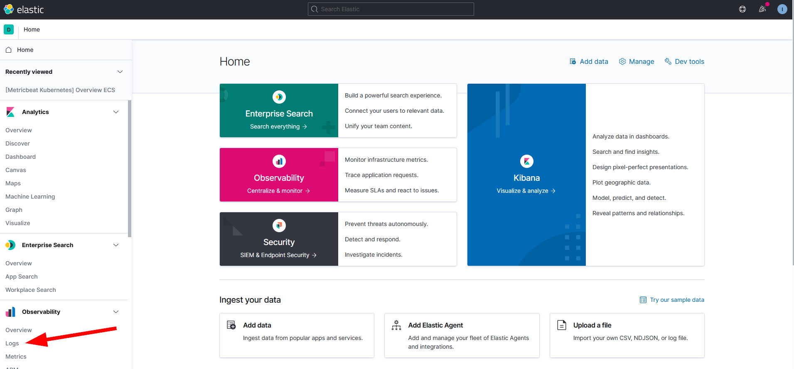
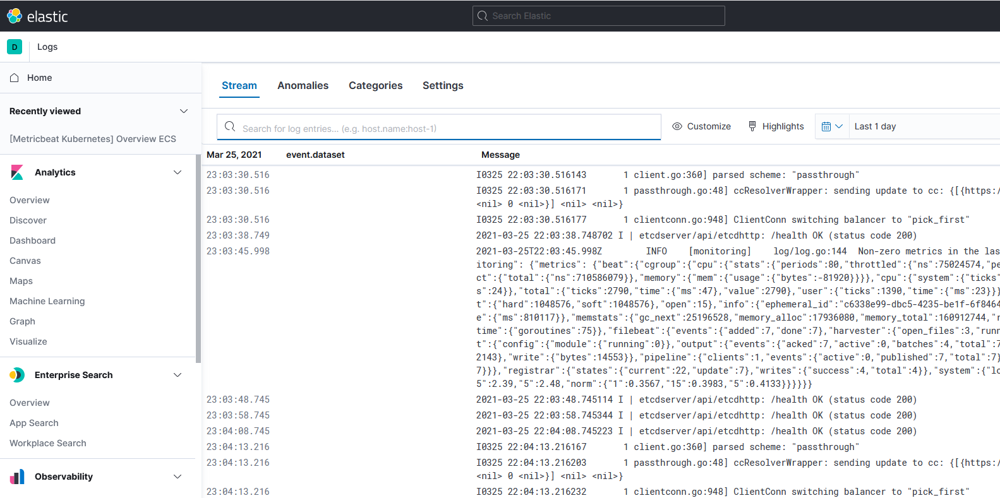
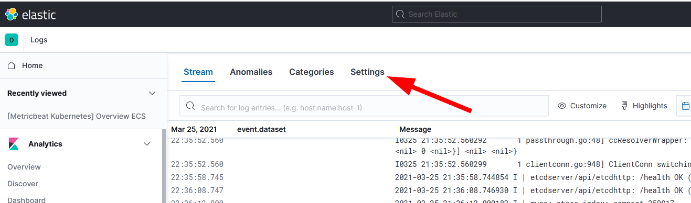
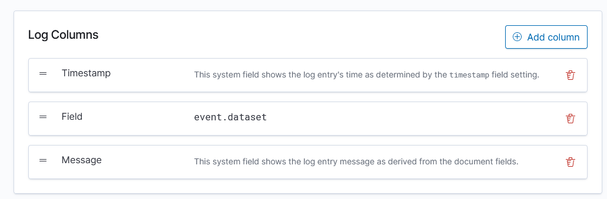
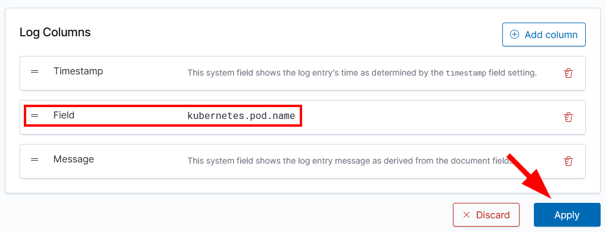
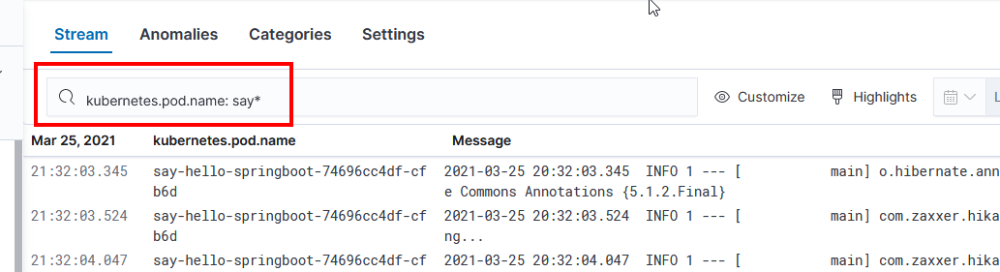
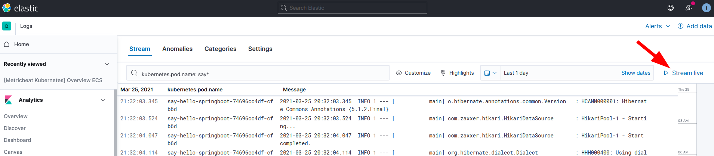
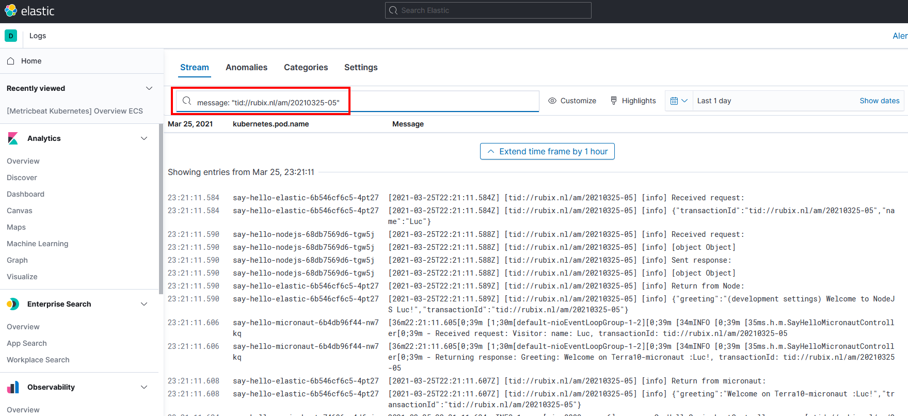

# Lab 2: Log files

In this lab, we will install Elastic `FileBeat` on the k8s cluster. FileBeat is an agent that picks up the log files and sends them to our Elastic Cloud instance.

## FileBeat installation

The installation of the FileBeat agent is done using the official Elastic Helm chart. First, add the Elastic Helm repository:
```bash
helm repo add elastic https://helm.elastic.co
helm repo update
```

The FileBeat will be deployed to the k8s cluster into the namespace `rubix-am-elastic`. First, create the namespace:
```bash
kubectl create ns rubix-am-elastic
```

Go to the directory:

```bash
cd  lab-2_log-files
cp values-filebeat-cloud-org.yml values-filebeat-cloud.yml
```

Now edit the file `values-filebeat-cloud.yml` and make 2 replacements:

| string | replace with |
|--------|--------------|
| [todo: set cloud.id ] | The Cloud ID from lab 0 | 
| [todo: set elastic user/pwd ] | The elastic user/pwd from lab 0, formatted as "<user>:<password>"  | 


Next, the Helm chart can be deployed:
```bash
helm install filebeat --values values-filebeat-cloud.yml -n rubix-am-elastic elastic/filebeat
```

Verify that the FileBeat Pods is started with `kubectl get pod -n rubix-am-elastic`. The output should look like:

```bash
NAME                      READY   STATUS    RESTARTS   AGE
filebeat-filebeat-hlwjq   1/1     Running   0          31s
```

## Log files in Elastic Cloud

Now it's time to look at the log files in the Elastic Cloud instance.

First, log in, and go to your Kibana instance. It should look like shown below:

Go to the `Logs` section under `Observability` :



Scrolling through the log lines you should notice:
- ALL log files of the k8s cluster are collected
- Log lines that are dated from before the deployment of FileBeat are also collected
- It is hard to find the log lines of our test service

## Changing settings to show Pod names

Often, users like to know from what Pod a log line originates. We will make some changes to the Settings:



Click `Settings` and scroll down to the `Log Columns` part:


Change this to show the `kubernetes.pod.name` instead of the `event.dataset`



Click `Apply` and return to the `Stream` section.

Now enter `kubernetes.pod.name: say*` in the search bar:



This will show all the logs of the Pods of our sample application.

## Streaming logs

Many Kibana dashboards/apps hava a `Stream live`  option. In this mode, they are re-freshed on a regular basis:



Click the `Stream live` button ... and watch that nothing happens ;-)

Next is to invoke the service like we did in the previous lab:
```bash
curl -X POST http://localhost:8010/api/sayhelloelastic -H "Content-Type: application/json" -d '{"transactionId" : "tid://rubix.nl/am/20210325-02", "name": "Luc" }'
```
Now, watch the service log lines scroll by.

## The transaction id

Stop streaming the logs by clicking `Stop streaming` in the upper right corner. 

Invoke the service a couple of more times, and use a different transaction id on each invoke.

Next, enter one of the transaction ids in a search query as shown in the example below (mind the quotes):



Note how all the log lines that have the transaction id are shown. Of course, that requires the microservice to log the transactino id!
