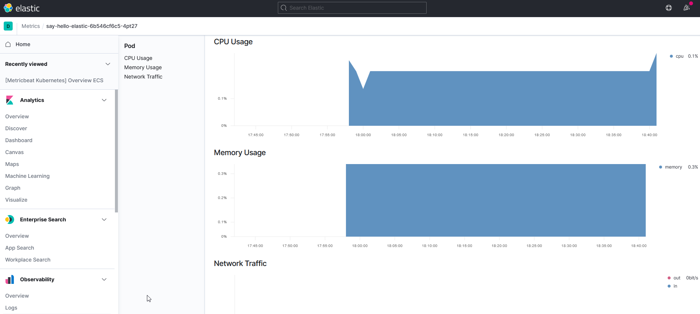

# Lab 3: Metrics

In this lab, we will install Elastic `MetricBeat` on the k8s cluster. MetricBeat is an agent that picks up various metrics (about your system and the k8s cluster) and sends them to our Elastic Cloud instance.

Important to understand: Elastic has a three ways to look at metrics data:
1. Metrics app - a standard Elastic app for examining specific metrics 
2. Default metrics dashboards - provided (by Elastic) for various technical components including k8s
3. Custom dashboards - it is possible to develop custom dashboards that display the metrics data

This Lab has the following steps:
1. Intallation of MetricBeat on k8s cluster
2. Upload sample Metrics dashboards into Elastic Cloud
3. Metrics app in Elastic Cloud
4. Default metrics dashboards
5. Custom dashboards


## 1. MetricBeat installation

The installation of the MetricBeat agent is done using the official Elastic Helm chart. 

If you have not done the FileBeat lab, then add the Elastic Helm repository:

```bash
helm repo add elastic https://helm.elastic.co
helm repo update
```

The MetricBeat will be deployed to the k8s cluster into the namespace `rubix-am-elastic`. If not done in the previous lab, create the namespace:

```bash
kubectl create ns rubix-am-elastic
```

Go to the directory:

```bash
cd  lab-3_metrics
cp values-metricbeat-cloud-org.yml values-metricbeat-cloud.yml
```

Now edit the file `values-metricbeat-cloud.yml` and make 2 x 2 replacements:

| string | replace with |
|--------|--------------|
| [todo: set cloud.id ] | The Cloud ID from lab 0 | 
| [todo: set elastic user/pwd ] | The elastic user/pwd from lab 0 | 


Next, the Helm chart can be deployed:

```bash
helm install metricbeat --values values-metricbeat-cloud.yml -n rubix-am-elastic elastic/metricbeat
```

Verify that the FileBeat Pods is started with `kubectl get pod -n rubix-am-elastic`. The output should look like:

```bash
NAME                                             READY   STATUS    RESTARTS   AGE
filebeat-filebeat-hlwjq                          1/1     Running   0          54m
metricbeat-kube-state-metrics-5d6986df65-gndd6   1/1     Running   0          29s
metricbeat-metricbeat-86c4g                      1/1     Running   0          29s
metricbeat-metricbeat-metrics-864d8885b4-f84s2   1/1     Running   0          29s
```

## 2. Upload sample Metrics dashboards into Elastic Cloud

The MetricBeat Pods are by now sending a lot of data into your Elastic Cloud instance.

However, as there are no default dashboards there, it is only possible to look at the raw data - which we don't want to. However, MetricBeat has some default dashboards that can be uploaded to the Elastic Cloud.

Download metricbeat and untar:

```bash
curl -L -O https://artifacts.elastic.co/downloads/beats/metricbeat/metricbeat-7.11.2-linux-x86_64.tar.gz
tar xzvf metricbeat-7.11.2-linux-x86_64.tar.gz
```

For uploading the dashboards, a configuration file needs to point to the Elastic Cloud instance:

```bash
cd  lab-3_metrics
cp metricbeat-cloud-org.yml metricbeat.yml
```
Now edit the file `metricbeat.yml` and make 2 replacements:

| string | replace with |
|--------|--------------|
| [todo: set cloud.id ] | The Cloud ID from lab 0 | 
| [todo: set elastic user/pwd ] | The elastic user/pwd from lab 0 | 

The file can then be moved to the directory where the metricbeat is untar-ed:

```bash
cd  lab-3_metrics
mv metricbeat.yml metricbeat-7.11.2-linux-x86_64
```

Upload the dashboards:

```bash
cd  lab-3_metrics/metricbeat-7.11.2-linux-x86_64
./metricbeat setup -e 
```
This should show the loading of the dashboards (this will take a while).


## 3. Metrics app in Elastic Cloud

Now we will look at the Metrics app in the Elastic Cloud instance.

First, log in, and go to your Kibana instance. It should look like shown below:


Go to the `Metrics` section under `Observability` :


In the top tab several selection criteria can be selected, and the view can be changed from tile to table:


Reproduce the table below:


Left-click the Pod `say-hello-springboot-...`  and select `Kubernetes Pod metrics`:


This should bring you to the page:



Feel free to explore some more...


## 4. Default metrics dashboards

Now, go to the dashboards tab:


This shows the list of over hundred default dashboards. Enter `kubernetes` in the search bar and then select `[Metricbeat Kubernetes] Overview ECS`:


That will show the dashboard as shown below:


Next, go to the dasboard with systems data: `[Metricbeat System] Overview ECS`:


Doing some service invokes (with curl) will affect what is shown ... try it!

Also have a look at the `Host Overview` and `Containers overview`.


## 5. Custom dashboards

The Metrics app and default dashboards do provide useful information, but in real life ... you will want to make your own dashboards.

This is not a 'How to make a Kibana dashboard' Lab: plenty examples can be found on the internet. So, we have a customer dashboard present that you only need to import: go to Management - Stack Management - Kibana - Saved Objects


In the upper right corner click ' Import' :


Now, import the `rubix-am-transactions.ndjson` file. 

Go to the Dashboard tab and enter `rubix`  in the search bar:


Click the dashboard:


Select part of the time period by right-mous-click-drag-release on the dashboard:


