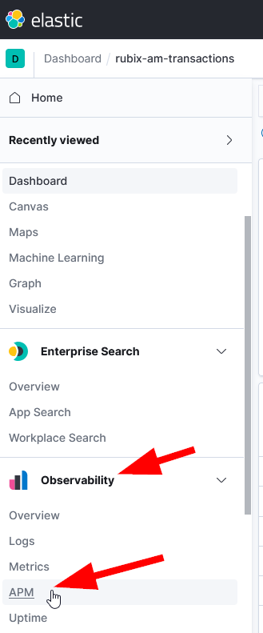
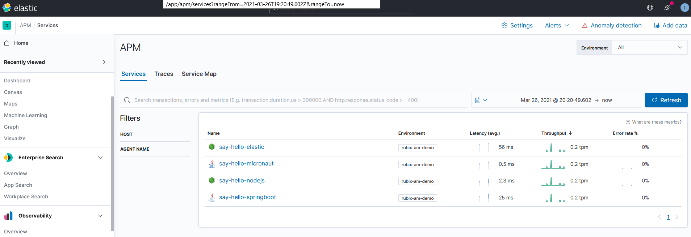
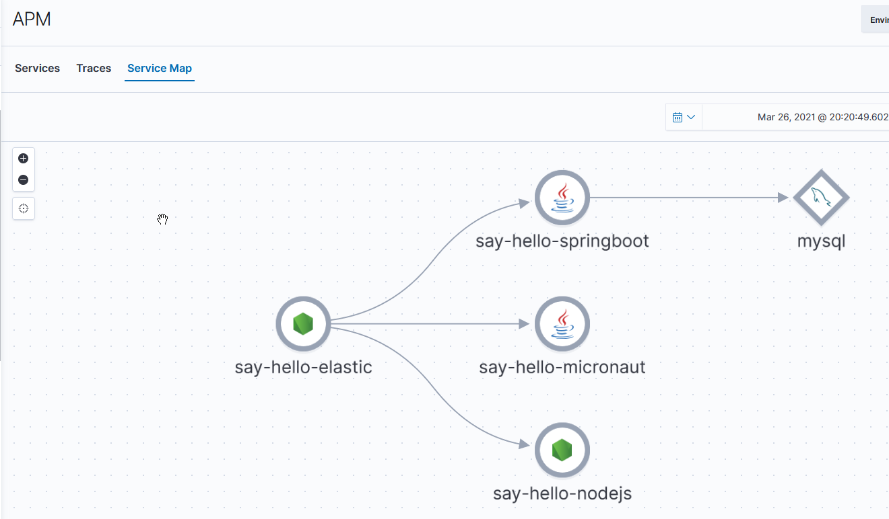
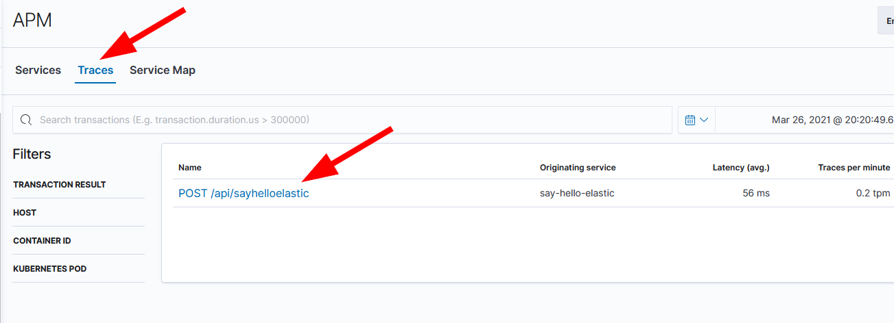
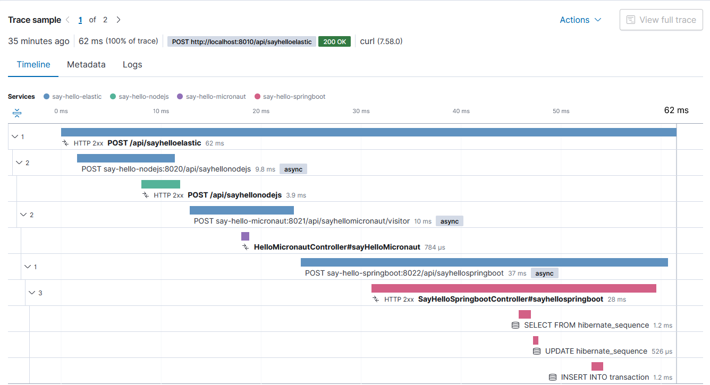

# Lab 4: Application Performance monitoring

For this Lab, no specific installation steps have to be done.

Go to the Observability - APM section:

The first page (Services) should look like:

You will see the 4 microservices and the technology that they are made with: NodeJS and Java.

Now, go to the 'Service Map' tab:

The Service Map is discovered by the APM Server itself: it is not necessary to identify the dependencies explicitly.

Now, visit the 'Traces' tab and select 'POST /api/sayhelloelastic':

The dashboard now shows some time statistics. Scrolling further down shows traces:

Scroll through these traces and try to identify what components take most time...

The 4 services (say-hello-*) are all `instrumented`, so they send their performance related data to the APM Server:
- the SpringBoot service did not require any code changes: an agent jar is added upon startup
- the NodeJS services require some minor code changes in the `server.js` file
- the Micronaut service required explicit coding to handle the performance data

Where the Micronaut changes are very intrusive, the effort for the others are very limited. And the added insight in runtime behaviour can be extremely valuable...

